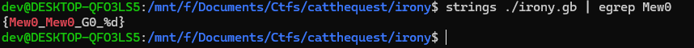

# CatTheQuest. Medium rev: Irony

## Quick brief
Challenge description:
```
One of the hackers is a GameBoy fan. You might find a crucial element to trace them in this file that was lingering on the network.
```
Attachment: `irony.gb` - Game Boy ROM image


## Step by step walkthrough
First of all, you can run `file` over `irony.gb`:
```sh
$ file irony.gb
irony.gb: Game Boy ROM image: "IRONY" (Rev.01) [CGB ONLY] [MBC5+RAM+BATT], ROM: 2Mbit, RAM: 256Kbit
```

Now you can try to run it within any emulator. I used `mGBA` and `SameBoy`, but I've seen it can be solved with many others.

While researching the game, you will figure out that the only way to finish the game is to break the `counter`.


Fortunately there is searching tool within `mGBA` that allows us to find necessary memory address using known values of the variable.


The necessary address is `cbb5`. Why `cbb5` and not `d915`? I figured out that this is just temporary value that is not used further. Also, most probably, data stored at wram0 (c000-cfff) is used for keeping important info.

Now let's open `SameBoy`: its debugger more convenient and user-friendly (even with crashes when deleting last watchpoint/breakpoint).

Set up read-write watchpoint and see what accesses the address.


So, for some purpose, counter is resetting before doing any checks.

But a little later we observe this figure:


What we see here? Address data has been written to `A` register! ..and then moved to `C`.

It can be assumed that the counter check is somewhere nearby..

After a short tracing:


As we all know, the `SUB` instruction can be used as an alternative to `CMP`: according to SM83 documentation if you use `SUB r` then value of `r` subtracts from `A` register.

If `A` == `r`, then `Z` sets as 1 and we can jump further.


So what we have to do next? Our `C` register isn't equal to `A`.


Hold my beer:


We've just assigned `A` to `C` and now we can pass the check.

Do the same for the next 1 byte which is also needed cuz it's a 2-byte long `counter`.


Gogogog try it!


Ok, we got our flag: `CAT{Mew0_Mew0_0}`

Or not?

Unfortunately, it's not the end.

If we take a look at `irony.gb` with `strings` (or hex editor), we'll find this:



So what we need is the number we previously inspected in `SameBoy` debugger: `0x782f`, not the ZERO.

The final flag will be `CAT{Mew0_Mew0_30767}`.
